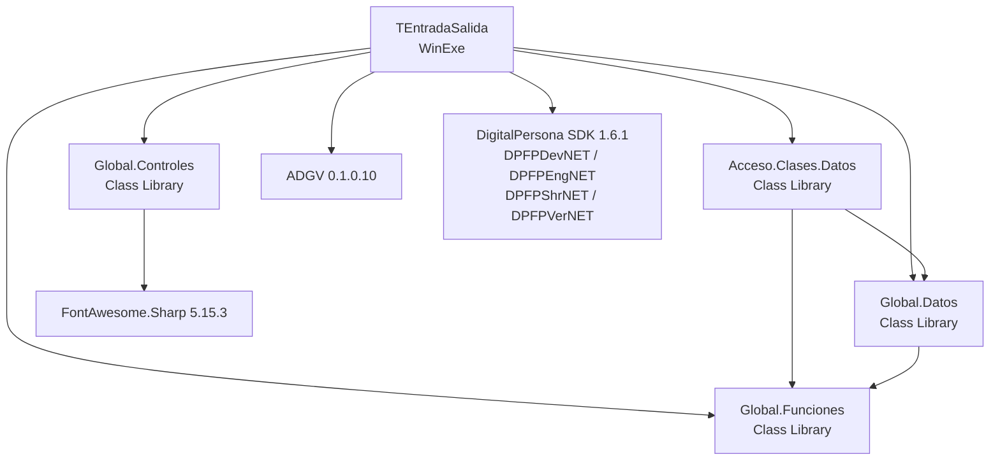

# Reporte Técnico para Programador — TEntradaSalida (Fichador de Huellas)

**Fecha:** 2026-02-28
**Generado por:** Claude Sonnet 4.6 — Diagnóstico inicial
**Solución:** `TEntradaSalida.sln`

---

## 1. Resumen Técnico del Sistema

Sistema de escritorio **WinForms (.NET Framework 4.8)** para **control de asistencia por huella digital**. El sistema captura huellas digitales mediante un lector DigitalPersona uAreU 4500, las compara contra todas las huellas registradas en base de datos y registra el fichaje (entrada/salida) del empleado.

**Funcionalidad core:**
- Captura continua de huella digital mediante lector USB
- Comparación 1:N contra todas las huellas almacenadas en SQL Server
- Registro de fichada (SP determina si es entrada o salida)
- Identificación de la terminal por nombre de máquina (`Environment.MachineName`)
- Semáforo visual (rojo/amarillo/verde) como feedback al operador

**No tiene:** login de usuario, configuración visual, reportes propios. Es una terminal de fichaje dedicada.

---

## 2. Cómo Correr el Proyecto

### Requisitos previos

| Requisito | Detalle |
|---|---|
| Visual Studio | 2019 o superior (la solución indica VS 18.3) |
| .NET Framework 4.8 | Debe estar instalado en el equipo de desarrollo |
| SQL Server | Instancia accesible en red (ver connection strings) |
| DigitalPersona One Touch SDK | Instalado en `C:\Program Files\DigitalPersona\One Touch SDK\` |
| Lector de huellas | DigitalPersona uAreU 4500 conectado por USB |

### Pasos

1. **Abrir la solución:**
   ```
   TEntradaSalida\TEntradaSalida.sln
   ```

2. **Restaurar paquetes NuGet** (clic derecho sobre la solución → Restore NuGet Packages):
   - `ADGV 0.1.0.10` — AdvancedDataGridView (TEntradaSalida y Acceso.Clases.Datos)
   - `FontAwesome.Sharp 5.15.3` — Iconos (Global.Controles)

3. **Verificar que los proyectos Common existen** en la ruta relativa:
   ```
   C:\Apps\Claude\Huellas\DigitalPusDesk_Claude\DigitalOnePlus\Common\
   ```
   Si la solución se mueve de lugar, las referencias relativas se rompen.

4. **Configurar `app.config`** en `TEntradaSalida\app.config`:
   - Verificar connection string `ConTocayAnda` apunte al servidor correcto
   - Verificar que el SDK DigitalPersona esté instalado (los DLL se referencian por ruta absoluta)

5. **Registrar la terminal en BD**: La tabla `GRALTerminales` debe tener un registro con `sTerminalID = nombre_del_equipo`. Si no existe, la sucursal no se carga pero el sistema igualmente arranca.

6. **Compilar:** Build → Build Solution (`Ctrl+Shift+B`)

7. **Ejecutar:** F5 o `bin\Debug\TEntradaSalida.exe`

### Errores comunes

| Error | Causa | Solución |
|---|---|---|
| No resuelve DPFPDevNET.dll | SDK DigitalPersona no instalado | Instalar One Touch SDK 1.6.1 |
| No resuelve proyectos Common | Solución movida de lugar | Restaurar estructura de directorios |
| "Operación de captura fallida" | Lector no conectado o no reconocido | Conectar lector, instalar drivers |
| Pantalla en negro / sin sucursal | Terminal no registrada en GRALTerminales | Insertar registro en BD |
| Timeout DB | Cadena de conexión incorrecta | Corregir app.config |

---

## 3. Mapa del Repositorio

| Proyecto | Tipo | Ruta | Responsabilidad |
|---|---|---|---|
| **TEntradaSalida** | WinExe (.NET 4.8) | `Fichador\TEntradaSalida\` | App principal. UI de fichaje. Único formulario: `FrmFichar` |
| **Acceso.Clases.Datos** | Class Library | `Common\Acceso.Clases.Datos\` | Entidades de dominio RRHH + acceso a datos específico del negocio |
| **Global.Datos** | Class Library | `Common\Global.Datos\` | Capa de infraestructura: clase estática `SQLServer` con todos los métodos ADO.NET |
| **Global.Funciones** | Class Library | `Common\Global.Funciones\` | Utilidades transversales: configuración, cadenas, formatos, mail |
| **Global.Controles** | Class Library | `Common\Global.Controles\` | Librería de controles WinForms personalizados (botones, grillas, etiquetas, etc.) |

**Proyectos en Common NO incluidos en esta solución** (presentes en disco):
- `ControlEntidad` — Controles de búsqueda de entidades
- `Global.Calendario` — Control de calendario
- `Global.DigitalPersona` — NO CONFIRMADO su contenido exacto
- `Global.Controles - copia` — Copia antigua, no usar

### Diagrama de dependencias



---

## 4. Dependencias

### NuGet

| Paquete | Versión | Usado en | Propósito |
|---|---|---|---|
| ADGV | 0.1.0.10 | TEntradaSalida, Acceso.Clases.Datos | AdvancedDataGridView con filtros |
| FontAwesome.Sharp | 5.15.3 | Global.Controles | Iconos en controles custom |

### SDK Externo (DLL manual — ruta absoluta en .csproj)

| DLL | Versión | Ruta |
|---|---|---|
| DPFPDevNET.dll | 1.6.1.0 | `C:\Program Files\DigitalPersona\One Touch SDK\.NET\Bin\` |
| DPFPEngNET.dll | 1.6.1.0 | ídem |
| DPFPShrNET.dll | 1.6.1.0 | ídem |
| DPFPVerNET.dll | 1.6.1.0 | ídem |

> **Riesgo:** Si el SDK no está instalado exactamente en esa ruta, el proyecto no compila.

### Frameworks / Patrones

| Categoría | Implementación |
|---|---|
| ORM | **ADO.NET puro** — sin Entity Framework en runtime (EF está configurado en app.config pero no se usa en este proyecto) |
| Acceso a datos | Clase estática `Global.Datos.SQLServer` + Stored Procedures |
| Logging | **Ninguno** |
| DI / IoC | **Ninguno** |
| Reporting | **Ninguno** en este módulo |
| UI custom | `Global.Controles` (controles propios del ecosistema) |

---

## 5. Configuración Relevante

Archivo: `TEntradaSalida\app.config`

### Connection Strings (TODAS con credenciales en texto plano)

| Nombre | Servidor | Base de datos | Usuario |
|---|---|---|---|
| `Local` | GUS-IDEAPAD | DigitalOne | sa |
| `ksk` | 192.168.0.11 | Tocayanda | sa |
| `ConTocayAnda` | 192.168.0.11 | Tocayanda | sa | ← **string usada por defecto** |
| `ConTocayAnda_real` | sd-1985882-l.ferozo.com:11434 | DigitalPlus | sa |

> **CRÍTICO:** Contraseña `Soporte1` con usuario `sa` hardcodeada en app.config. Si alguien accede al archivo de configuración (o al binario distribuido), tiene acceso total al SQL Server.

### Cómo se resuelve la conexión en runtime

1. `Global.Datos.SQLServer.ActualizarProp()` lee `ConnectionStrings["ConTocayAnda"]` del app.config
2. Si está vacío, cae a `CadenaporConfiguracion()` que lee de `AppSettings` con valores default hardcodeados (`sa/Soporte1`, IP `192.168.0.11`)
3. `ConnectionSql.cs` (en Acceso.Clases.Datos) también tiene su propia construcción de cadena con los mismos defaults

---

## 6. Acceso a Datos

### Patrón General

```
FrmFichar  →  Acceso.Clases.Datos (clases RRHH*)  →  Global.Datos.SQLServer  →  SQL Server
```

- **No hay repositorios formales.** Las clases del dominio (ej: `RRHHFichadas`, `GRALTerminales`) invocan directamente `Global.Datos.SQLServer`.
- **No hay transacciones explícitas** en el código revisado.
- **No hay Unit of Work** ni patrón Repository.

### Tablas y Objetos de BD Identificados

| Objeto BD | Tipo | Clase que lo usa | Operación |
|---|---|---|---|
| `RRHHLegajosHuellas_View` | Vista | `RRHHLegajosHuellas.TodasLasHuellas()` | SELECT * (carga total en cada scan) |
| `RRHHLegajosHuellas_SP_SELECT` | Stored Procedure | `RRHHLegajosHuellas.Inicializar()` | SELECT por legajo |
| `RRHHLegajosHuellas_SP` | Stored Procedure | `RRHHLegajosHuellas.Actualizar()` | INSERT/UPDATE huella |
| `RRHHFichadas_SP_SALIDA` | Stored Procedure | `RRHHFichadas.Actualizar()` | Registra fichada (determina E/S) |
| `RRHHFichadas_SP_MANUAL` | Stored Procedure | `RRHHFichadas.Actualizar(par)` | Fichada manual |
| `RRHHFichadas_SP_MANUAL_SELECT` | Stored Procedure | `RRHHFichadas.TraerFichadas()` | Consulta de fichadas |
| `RRHHFichadasEntradaEstatusLegajo_SP_SELECT` | Stored Procedure | `RRHHFichadas.TraerLlegadasTarde()` | Llegadas tarde |
| `GRALTerminales` | Tabla | `GRALTerminales.Inicializar()` | SELECT por terminal (SQL concatenado) |
| `GRALTerminales_SP` | Stored Procedure | `GRALTerminales.Actualizar()` | INSERT/UPDATE terminal |
| `GRALTerminales_Delete` | Stored Procedure | `GRALTerminales.Eliminar()` | DELETE terminal |
| `master.dbo.sysdatabases` | Vista sistema | `SQLServer.ChequearConexion()` | Verificación de conexión |

### Manejo de Errores en BD

- La mayoría de los métodos tienen `try/catch` que devuelven `false` o un `DataTable` vacío y muestran `MessageBox.Show(ex.Message)` — **no hay logging persistente**.
- `RRHHLegajosHuellas.TodasLasHuellas()` captura la excepción y la guarda en `sMensajeError` pero no notifica al usuario.
- `RRHHFichadas.Actualizar()` tiene un catch vacío (solo retorna `false`).

---

## 7. Top 10 Puntos Críticos

### #1 — SQL Injection en GRALTerminales.Inicializar()
**Archivo:** `Common\Acceso.Clases.Datos\Generales\GRALTerminales.cs:58`
```csharp
cadena = "Select * from " + tabla + " where sTerminalID = '" + sTerminalID + "'";
```
`sTerminalID` proviene de `Environment.MachineName`. Riesgo bajo en producción normal, pero el patrón es peligroso y debe corregirse con parametrización.

---

### #2 — SQL Injection en SQLServer.ChequearConexion()
**Archivo:** `Common\Global.Datos\SQLServer.cs:225`
```csharp
string queryString = "Select name from master.dbo.sysdatabases where name = '" + SQLDataBase + "'";
```
`SQLDataBase` proviene del app.config. Si el config es modificado maliciosamente, hay riesgo real.

---

### #3 — Credenciales sa/Soporte1 en texto plano
**Archivo:** `TEntradaSalida\app.config:9-12`
**Archivo secundario:** `Common\Acceso.Clases.Datos\ConnectionSql.cs:10-12`
**Archivo secundario:** `Common\Global.Datos\SQLServer.cs:468-471`

Usuario `sa` con contraseña `Soporte1` en 4 connection strings, incluyendo una IP pública (`sd-1985882-l.ferozo.com:11434`). Sin cifrado. Cualquier acceso al archivo o binario expone credenciales de administrador de SQL Server.

---

### #4 — Carga completa de huellas en cada scan
**Archivo:** `TEntradaSalida\uAreu\FrmFichar.cs:95` → `Common\Acceso.Clases.Datos\RRHH\RRHHLegajosHuellas.cs:71`
```csharp
dtLegajosHuellas = SQLServer.EjecutarParaSoloLectura("select * from RRHHLegajosHuellas_View");
```
Por cada captura de huella se ejecuta un `SELECT *` completo. Con 100+ empleados con 2 huellas cada uno, esto implica transferir cientos de registros binarios en cada scan. Debe cachearse en memoria al iniciar.

---

### #5 — Sin manejo async: riesgo de congelamiento de UI
**Archivo:** `TEntradaSalida\uAreu\FrmFichar.cs:94-167`

El método `Process()` es llamado desde el hilo del SDK de DigitalPersona. Las llamadas a BD dentro son sincrónicas. Si la red está lenta o la BD no responde, el lector queda bloqueado sin posibilidad de respuesta. No hay timeout configurable.

---

### #6 — catch vacíos / silenciosos
**Archivo:** `TEntradaSalida\uAreu\FrmFichar.cs:177-183` (método `Start`)
```csharp
catch { SetPrompt("No se puede iniciar la captura"); }
```
**Archivo:** `TEntradaSalida\uAreu\FrmFichar.cs:190-196` (método `Stop`)
**Archivo:** `Common\Acceso.Clases.Datos\RRHH\RRHHFichadas.cs:57-60`

Excepciones swallowed sin logging. Si el lector falla al iniciarse, el error queda invisible en producción.

---

### #7 — Bug en RRHHFichadas.TraerFichadas()
**Archivo:** `Common\Acceso.Clases.Datos\RRHH\RRHHFichadas.cs:87-107`
```csharp
// Declara variable local 'param' pero llena 'par' (campo de instancia)
SqlParameter[] param = new SqlParameter[4];
par[0] = new SqlParameter("@ld", ...);  // ← usa 'par', no 'param'
...
return SQLServer.EjecutarSPSelect("...", par);  // ← pasa 'par'
```
`param` se declara pero nunca se usa. Los parámetros se cargan en `par` (campo de instancia compartido). Puede causar bugs si el objeto se reutiliza.

---

### #8 — Ruta absoluta del SDK hardcodeada en .csproj
**Archivo:** `TEntradaSalida\TEntradaSalida.csproj:62-76`
```xml
<HintPath>..\..\..\..\Program Files\DigitalPersona\One Touch SDK\.NET\Bin\DPFPDevNET.dll</HintPath>
```
El SDK debe estar instalado exactamente en `C:\Program Files\`. Si el proyecto se compila en un equipo con SDK en otra unidad o ruta, falla. No hay copia local de los DLL.

---

### #9 — Sin sistema de logging
En toda la solución no existe ningún mecanismo de logging (ni NLog, ni Serilog, ni log4net, ni System.Diagnostics.Trace estructurado). Los errores se muestran como `MessageBox.Show(ex.Message)` o se descartan silenciosamente. En producción, los errores quedan sin registro.

---

### #10 — Sin autenticación de usuario en la app
**Archivo:** `TEntradaSalida\Program.cs:19`
```csharp
Application.Run(new Acceso.uAreu.FrmFichar());
```
La aplicación arranca directamente en el formulario de fichaje sin ningún control de acceso. Cualquier usuario que ejecute el binario puede interactuar con el sistema.

---

## 8. Backlog Técnico Sugerido

### Quick Wins (1–3 días)

| # | Tarea | Archivo/Clase afectada |
|---|---|---|
| QW-1 | Parametrizar SQL en `GRALTerminales.Inicializar()` | `GRALTerminales.cs:58` |
| QW-2 | Parametrizar SQL en `SQLServer.ChequearConexion()` | `SQLServer.cs:225` |
| QW-3 | Corregir bug de `param` vs `par` en `TraerFichadas()` | `RRHHFichadas.cs:87` |
| QW-4 | Eliminar carpeta `Global.Controles - copia` del disco | `Common\Global.Controles - copia\` |
| QW-5 | Agregar logging básico en catch de `Start()` y `Stop()` | `FrmFichar.cs:177-196` |
| QW-6 | Renombrar typo `BlulkCopy` → `BulkCopy` | `SQLServer.cs:66` |

### Mejoras Medianas (1–3 semanas)

| # | Tarea | Impacto |
|---|---|---|
| MM-1 | Cachear huellas en memoria al iniciar (no recargar en cada scan) | Rendimiento crítico — `FrmFichar.cs:95` |
| MM-2 | Mover credenciales de app.config a mecanismo seguro (Windows DPAPI o variable de entorno cifrada) | Seguridad |
| MM-3 | Incorporar un sistema de logging (NLog o Serilog) en reemplazo de `MessageBox.Show` para errores | Mantenibilidad / soporte |
| MM-4 | Reemplazar referencia absoluta al SDK por copia local de DLL en `\lib\` del proyecto | Portabilidad del build |
| MM-5 | Agregar timeout y manejo de reconexión en el flujo `Process()` | Robustez |
| MM-6 | Documentar y limpiar los proyectos Common que están en disco pero no en la solución | Deuda técnica |

---

*Fin del Reporte Programador*
